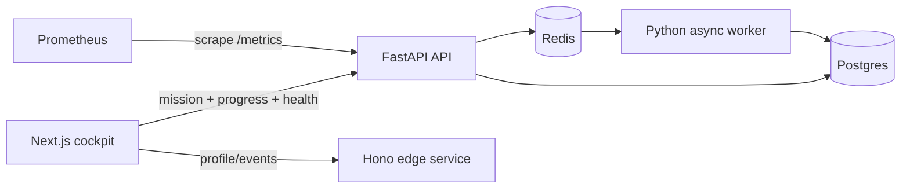

# Architecture

## Runtime shape

The browser is an operator surface, not the source of truth. FastAPI loads versioned mission manifests from `missions/`, stores local progress in `data/progress.json`, and owns ClaimOps domain APIs. Domain data is in Postgres. Redis provides a deliberately simple local queue that missions can evolve toward safer delivery semantics.

## Service boundaries

### Web

Next.js App Router server components fetch initial mission, progress, and health data. Client components are limited to filtering and progress mutation. API outages render explicit offline states instead of crashing the cockpit.

### API

FastAPI uses typed Pydantic boundaries and SQLAlchemy async sessions. Request middleware emits structured access logs and Prometheus RED metrics. Business policies live under `app/domain` when they can be pure and testable.

### Worker

The asyncio worker consumes JSON jobs from Redis and persists effects in Postgres. Its first-pass transport is intentionally flawed around acknowledgment, retries, and dead lettering because those are mission targets.

### Edge service

The Hono service keeps TypeScript backend practice in the monorepo. It owns a lightweight profile endpoint and typed event ingestion boundary. It is intentionally small so it remains a useful second service rather than an abstraction tax.

## Data model

- `roles`, `users`: actor identity and broad role.
- `claims`: workflow aggregate with explicit status and optimistic `version`.
- `claim_events`: append-oriented history and idempotency seam.
- `claim_notes`: public/internal operational notes.
- `assignments`: claim ownership history.
- `jobs`: durable job metadata; Redis is transport, not authoritative history.
- `audit_logs`: security-sensitive actor/resource actions.

All rows are synthetic and deterministic enough for repeatable missions.

## Local-to-GCP mapping

| Local | GCP path | Important difference |
|---|---|---|
| Docker containers | Cloud Run | Stateless, autoscaled instances |
| Postgres container | Cloud SQL for PostgreSQL | Managed connections, cost, IAM/network controls |
| Redis list | Pub/Sub | At-least-once delivery and ack deadlines |
| Local filesystem | GCS | Object semantics, IAM, no local atomic rename |
| JSON stdout | Cloud Logging | Indexed structured fields and retention cost |
| Prometheus | Managed Prometheus/Cloud Monitoring later | Local Prometheus remains sufficient for core missions |

The current worker is a Redis consumer. Moving it to Pub/Sub requires an explicit adapter or push endpoint; Terraform provisions the topic/subscription but does not pretend the transports are interchangeable.

